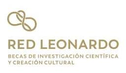

# Molden to OpenMolcas Converter 🔄⚛️

A lightweight, zero-dependency command-line utility to convert quantum chemistry output files from the Molden format (commonly generated by ORCA, Gaussian, Q-Chem) to the strict OpenMolcas `ScfOrb` (`.InpOrb`) format.

Fortran-based Molcas readers require highly specific column formatting and square matrices (where the number of MOs equals the number of AOs). This script parses the Molden file, formats the coefficients correctly, and automatically pads missing virtual orbitals if your electronic structure program only printed the occupied/active space.

## Features
* **Zero Dependencies:** Runs on pure Python standard libraries. No need to install `numpy` or `scipy`.
* **Automatic Padding:** Detects the total basis set size from the `[GTO]` section and pads the `[MO]` section with dummy virtual orbitals if necessary.
* **Strict Formatting:** Adheres to the `#INPORB 2.2` specification (`%22.14E` for coefficients and occupations, `%12.4E` for energies).
* **Smart Indexing:** Automatically generates the human-readable `#INDEX` mapping based on orbital occupation heuristics.

## Prerequisites

Python 3.6 or higher is required. Because this script relies entirely on the Python Standard Library, there are **no external packages to install**.

## Usage

Run the script directly from your terminal, passing the path to your `.molden` or `.input` file as the only argument.
```bash
    python molden2molcas_commented.py calculation.molden
```

### Output

The script will automatically generate a new file in the same directory with the `.InpOrb` extension (e.g., `calculation.InpOrb`).

```bash
$ python molden2molcas_commented.py water_orca.molden
Reading Molden file: water_orca.molden...
 -> Determined Basis Size: 24 Atomic Orbitals.
Warning: Extracted 10 MOs, but Basis has 24 AOs.
 -> Padding with 14 empty virtual orbitals.
Writing 24 MOs to water_orca.InpOrb...
Success! Output written to: water_orca.InpOrb
```
## License
MIT License

## Acknowledgments
Work produced with the support of a 2024 Leonardo Grant for Scientific Research and Cultural Creation, BBVA Foundation.


